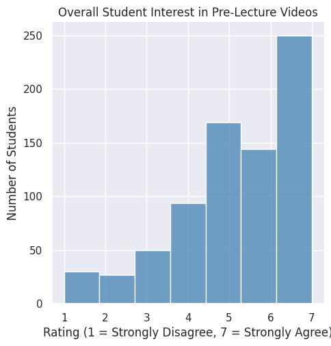
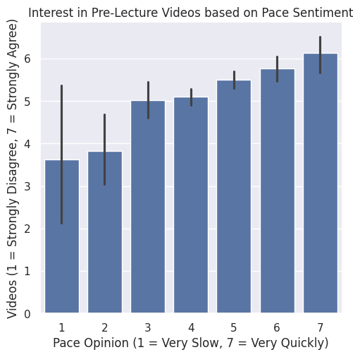
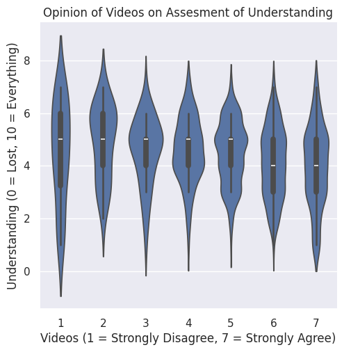

---
# Do not edit the text between these lines!
layout: default
---

### Part 1.1: Creative Ideation

1. a) The course should have optional exercise instructions for interdisiplinary projects. Ex: river simulation excercise for bio/stem majors, market simulation for business/econ, and brain cell simulation for premed. b) The value created is making the topics more interesting or relavent for non-CS students. c) The shareholders here are students and potentially the workforce of different industries that need CS experience.
2. a) The course should have more difficult projects that include material not taught in class available for extra credit. b) The value created is giving oportunties for students who want to improve their grades, improving understanding through practice, and expanding on material taught in class. c) The shareholders are the students.
3. a) The course should require that students attend at least 3 tutoring or office hour sessions for credit. b) The value created is encouraging utilization of the recources. Students who don't go might have different opinions than those that do. c) The shareholders are the students and the institution because they invest time and people into making these recources available.
4. a) The course should pair students of similiar skill levels and prefer studying together into study groups. b) The value created is ecouraging communication and collaboration. Some students might also perform better when working or studying in groups. c) The shareholders are the students and also instructional staff (students working with each other to study frees up tutoring/office hours availability for students who need specific help).
5. a) The course should include links to preclass videos that students can watch before class. b) The value created is increasing time spent engaging with material, allow the lecture to spend more time on important points rather than explain everything, and help students who think the pace of the course is too fast. c) The shareholders are the students and instructional staff. 

### Part 1.2: Identifying Missing Data

1. Idea without sufficient data to analyze: The course should pair students of similiar skill levels and prefer studying together into study groups. There is no data that talks about preference for working together. Another problem is there is no data about the availability or willingess of students to work with strangers outside of class.

2. Suggestion for how to collect data to support this idea in the future: At the beginning of the semester, there is a form where students indicate their availability and amount of time they want to dedicate to a study group. This data can be combined with data about grades or prior_ex to match students based on skill level.

### Part 1.3: Choosing Analysis

1. Idea to analyze with available data: The course should include links to preclass videos that students can watch before class. This has data available to completely analize. __pace__ will identify which students feel the course is moving too fast. There is data available on who wants pre class videos in __pre-lecture-videos__ and __understanding__, ___ls-effective__, and __difficulty__ can help us to determine if the students who want more preperation are the same that struggle with the pace. 

2. This idea is more valuable than the others brainstormed because: The possible change has the potential to add lots of value for students and the instructors. If the data we have suggests that students could improve their understanding. The value for the instructional staff is that class time can spend less time talking about the basics of a concept and instead focus on examples or areas that students might struggle with. 

## Loading and Previewing Data

I'm going to first upload both datasets (alyssa and izzi) and combine them into one dataset. I will then convert them to column based tables and use head to check the first few rows to make sure that everything is working and have an example of the data available.

## Selecting for relevant data

Now that we have all of the data together we can select for the relevant columns that we identified earlier in Part 1.3. Using select I will narrow down the data to the five columns I will need. I will then use tabulate and head again to check that the data is correct. 

## Identifying interest for pre-lecture videos

I'll start my analysis by using the count function to determine how many people are interested in the videos. 

### Helper Function: Data Cleaning Empty Cells and Strs

We've seen that there is strong interest in pre-lecture videos. The agree to strongly agree tallies outnumber the disagrees. Now we are going to filter out all the entries that don't have data. In order to perform analysis, I also need to conver the responses that are in strings and turn them into ints. This function will be the helper function. I will then fill new variables with the respective cleaned values.

### Making a Bar Chart to Observe Opinions towards Pre-Lecture Videos

Now that we have cleaned data, we can visualize data indicating preference for pre-lecture videos before breaking down the groups that might want it. We will use a bar chart which falls under displot in seaborn. The graph shows a strong preference for pre-lecture videos. The people that want videos (5-7) strongly outnumber those that do not or are neutral (1-4). 

### Analysis of Pace vs. Pre-lecture video interest with Barchart 

A core ideo of the argument is that people who think the pace of the class is to fast would benefit from the use of pre-class videos. In order to view this relationship we are going to create a categorical plot between these two variables. Seaborn automatically finds the average of pre-lecture videos based on pace and adds error bars. Here, there appears to be a clear positive correlation between people who feel that the pace of the class is to fast and those that want pre-lecture videos. 

### Analysis of Understanding vs. Pre-Lecture Video Interest

Here we will look at the relationship between how much interest a student has in pre-lecture videos and their assesment of the understanding of the content that they have. For this chart, we will use the violin chart in categorical section of Seaborn. This graph is interesting because it functions like a box-and-whisker plot but also has a kernal density estimate of the underlying data. We can see the distribution of responses for understanding at each level of interest in pre-lecture videos. The trend here is not as clear but there might be a very slight correlation between wanting the videos and not understanding as much of the material. 

### Part 1.5: Conclusion

Based on my analysis of the data, I support the reccomendation that pre-lecture videos should be integrated into the curriculum. The first point that supports this is the number of students that want these videos. The people who agree with having videos far outnumber the people who disagree or are indifferent. The next point that supports this is the bar chart showing a clear correlation between students who feel that the pace of the class is too fast and who want the videos. This correlation might exist because these students feel like videos will help to handle the pace of the class. Finally, we observed a very small correlation betwene a lack of understanding of material and desire for videos in the violin graph. The observed correlation was very small and it seems there is probably very little correlation between these. Despite this, the much more clear results of the first two graphs are enough for me to remain confident in my conclusion.

There are a number of benefits for the students as observed in the data. It seems that this change is something that would be welcomed by the students. There is a minority of the students who would not be supportive of this change. Implimenting this policy imposes some costs on the instructional staff who needs to do work identifying or potentially creating these videos. The benefit for the instructors is that classes will be much more focused on the material that is more important or that students are struggling with during lecture. The preferences that people have now might not match how they feel if such a policy is actually implimented. Further testing and surveying should be conducted before and after implimenting this policy to measure its effects. 
